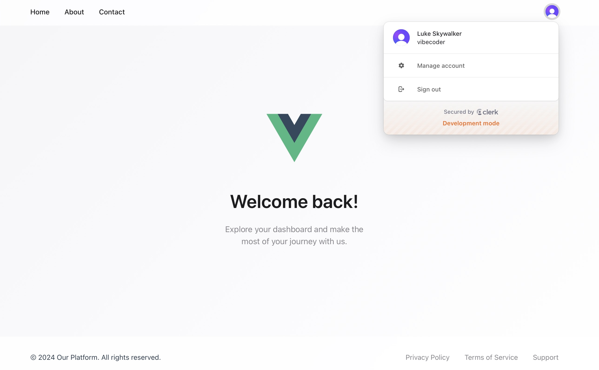

# 🌊 Weekly Vibe Coding

A collection of my weekend coding experiments, exploring new ideas and technologies.

## 🚀 Projects

### Project 1: [Discover Rome](https://github.com/YiweiShen/weekly-vibe-coding/tree/main/projects/project_1_discover_rome)

🌐 Deployed at: [https://discover-rome.pages.dev](https://discover-rome.pages.dev)

🛠️ Stack: Next.js, shadcn/ui, Tailwind CSS, TypeScript, GPT-4o, Cursor, Cloudflare Pages, Bolt, Stackblitz

An interactive web app showcasing Rome's hidden gems with curated insights, available in English and Chinese. The site features both light and dark modes and is mobile-friendly for an optimal user experience.

### Project 2: [Flying Fishes](https://github.com/YiweiShen/weekly-vibe-coding/tree/main/projects/project_2_flying_fishes)

🌐 Deployed at: [https://flying-fishes.pages.dev](https://flying-fishes.pages.dev)

🛠️ Stack: Lovable, React, Vite, shadcn/ui, Three.js, gpt-4o-copilot, VS Code, Cloudflare Pages, Codehooks

A single-page web app featuring a 3D flying fish animation. A short-term overlay is used to display the app introduction. An email subscription is available for users to receive updates.

### Project 3: [Clerk Vue](https://github.com/YiweiShen/weekly-vibe-coding/tree/main/projects/project_3_clerk_vue)

🌐 Deployed at: [https://clerk-vue.pages.dev](https://clerk-vue.pages.dev)

🛠️ Stack: Replit, Clerk, Vue 3, Vite, TypeScript, gpt-4o-copilot, Cloudflare Pages

A web app that allows users to sign in with Clerk. The app is built using Vue 3 and Vite.

### Project 4: [Cat Adoption API](https://github.com/YiweiShen/weekly-vibe-coding/tree/main/projects/project_4_cat_adoption_api)

🌐 Deployed at: [https://p4_test-fastcyanrabbit.web.val.run/docs](https://p4_test-fastcyanrabbit.web.val.run/docs)

🛠️ Stack: Val Town, Townie, Express.js, Swagger UI, Swagger JSDoc, gpt-4o-mini

A RESTful API for managing cat adoption information. It allows users to interact with data related to available cats, including listing, adding, and removing cats from the adoption list.

### Project 5: [Animate Search](https://github.com/YiweiShen/weekly-vibe-coding/tree/main/projects/project_5_animate_search)

🌐 Deployed at: [https://animate-search.pages.dev](https://animate-search.pages.dev)

🛠️ Stack: V0, Next.js, lucide-react, tailwindcss-animate, ChatGPT, Cloudflare Pages

A search bar with a unique animation effect resembling a starship entering hyperspace.

### Project 6: [Flappy Bird](https://github.com/YiweiShen/weekly-vibe-coding/tree/main/projects/project_6_flappy_bird)

🌐 Deployed at: [https://7tpg5v7ind.app.yourware.so/](https://7tpg5v7ind.app.yourware.so/)

🛠️ Stack: ChatGPT, Yourware

A modern-looking Flappy Bird clone.
