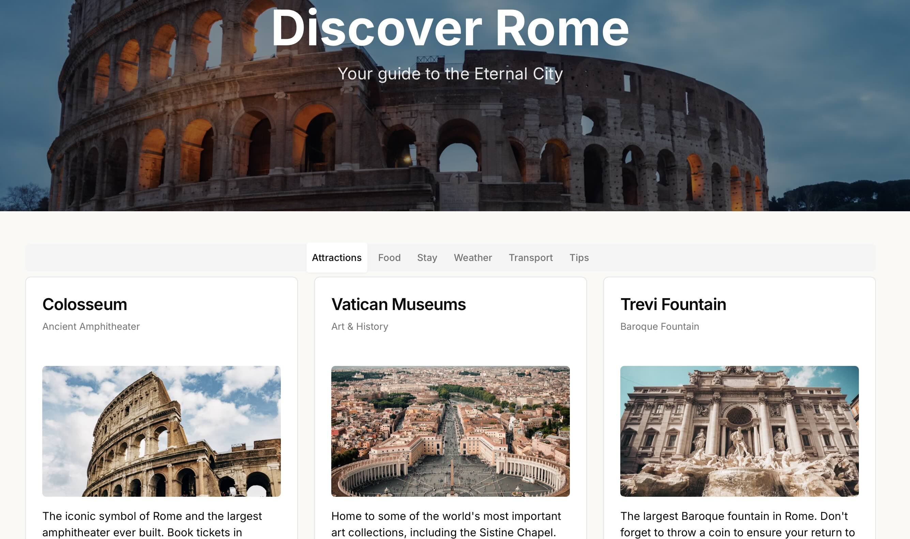

# project_1_discover_rome

## Stack:

- Brainstorm ideas with [ChatGPT](https://openai.com/chatgpt)
- Next.js-Shadcn template using [bolt.new](https://bolt.new/)
- Make it mobile-friendly with [Cursor IDE](https://cursor.sh/)
- Deploy using [Cloudflare Pages](https://pages.cloudflare.com/)

## URL

Cloudflare Pages: [https://discover-rome.pages.dev](https://discover-rome.pages.dev)
