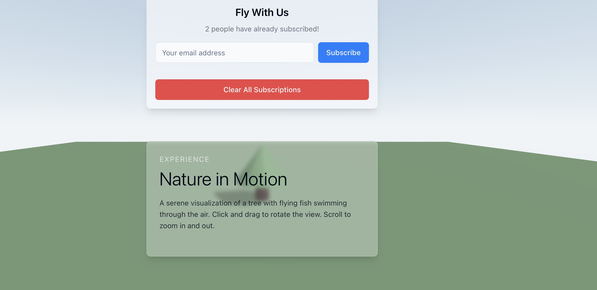

# project_2_flying_fishes/

## Stack:

- Create Vite template using [Lovable](https://lovable.dev)
- [TypeScript](https://www.typescriptlang.org/) and [React](https://reactjs.org/)
- [Shadcn/ui](https://ui.shadcn.com/) for the UI components
- Update the UI using [VSCode Copilot](https://marketplace.visualstudio.com/items?itemName=GitHub.copilot)
- [Three.js](https://threejs.org/) for 3D rendering
- Deploy on [Cloudflare Pages](https://pages.cloudflare.com/)
- Build CRUD API on [Codehooks](https://codehooks.io)

## URL

Cloudflare Pages: [https://flying-fishes.pages.dev](https://flying-fishes.pages.dev)
