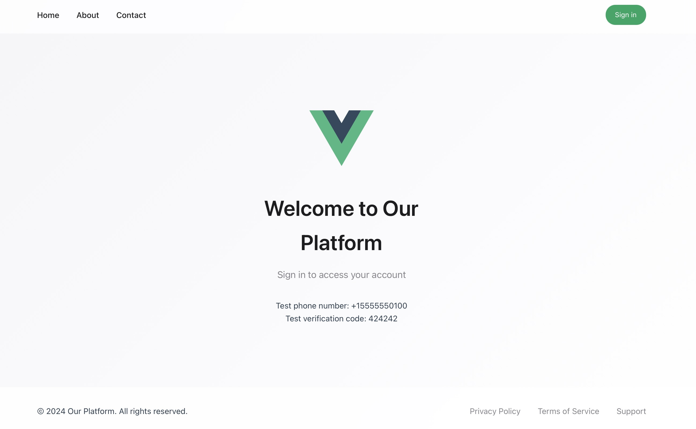
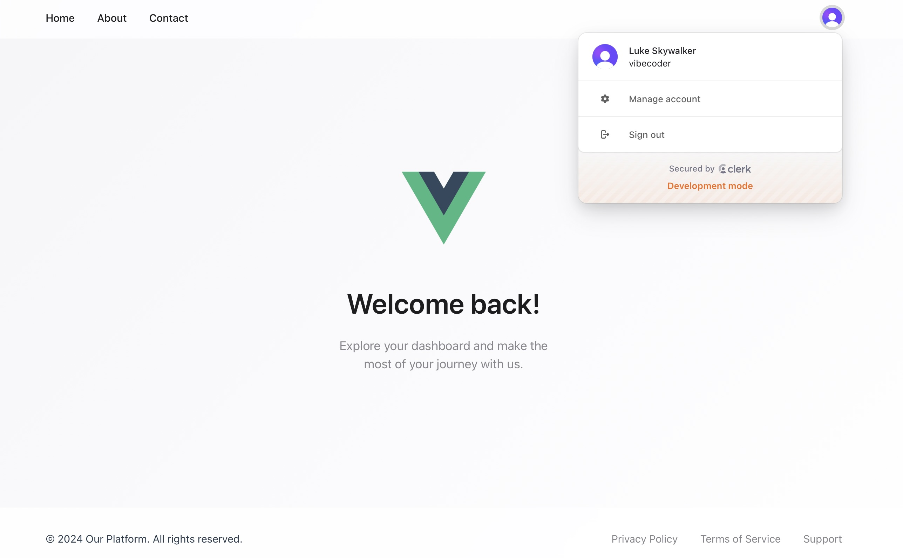

# project_3_clerk_vue

## Before Login

## After Login

## Stack

- Create the template using [Replit](https://replit.com/)
- Build using [Vue 3](https://vuejs.org/) with [Vite](https://vitejs.dev/)
- Add authentication and user management with [Clerk](https://clerk.com/)
- Develop efficiently with [VSCode](https://code.visualstudio.com/) + [Volar](https://marketplace.visualstudio.com/items?itemName=Vue.volar)
- Finetune the app with [GPT-4o](https://platform.openai.com/docs/models/gpt-4o)
- Deploy using [Cloudflare Pages](https://pages.cloudflare.com/)

## URL

Cloudflare Pages: [https://clerk_vue.pages.dev](https://clerk_vue.pages.dev)
