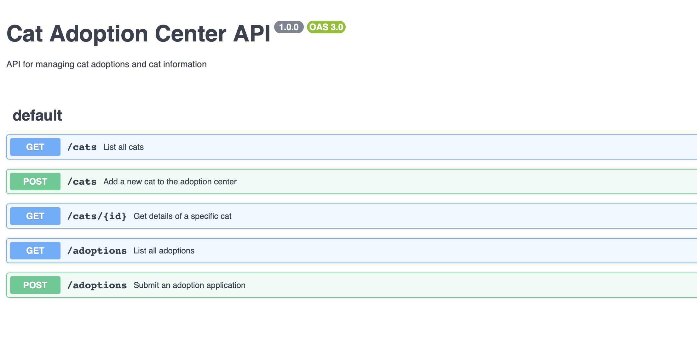

# project_4_cat_adoption_api

## Stack

- Backend built with [Express.js](https://expressjs.com/)
- API documentation powered by [Swagger UI Express](https://www.npmjs.com/package/swagger-ui-express) and [Swagger JSDoc](https://www.npmjs.com/package/swagger-jsdoc)
- Code generation and optimization using [gpt-4o-mini](https://platform.openai.com/docs/models/gpt-4o-mini)
- Code suggestions and enhancements with [Townie AI](https://www.val.town/townie)
- Deploy using Val Town [HTTP vals](https://docs.val.town/vals/http/)

## URL

Val Town Deployment: [https://p4_test-fastcyanrabbit.web.val.run/docs](https://p4_test-fastcyanrabbit.web.val.run/docs)
