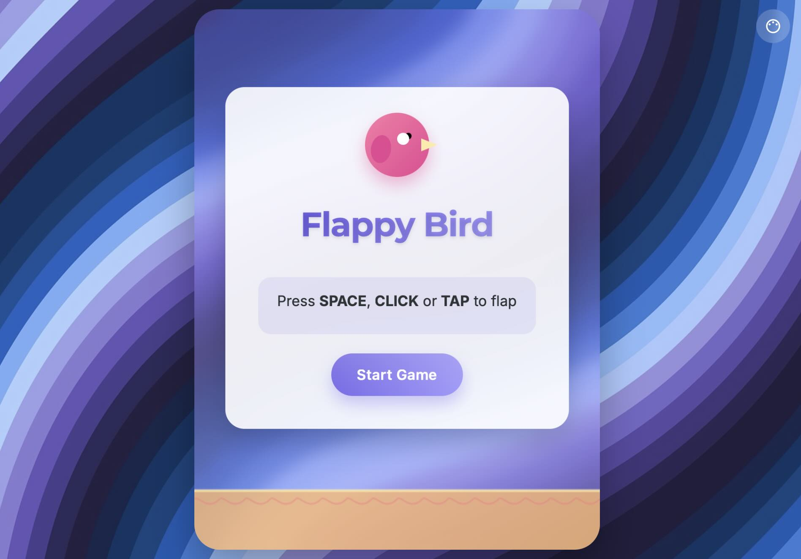

# project_6_flappy_bird

## Stack

- Finetune the prompting with [ChatGPT](https://chatgpt.com/)
- Create and deploy the app with [Yourware](http://yourware.so)

## URL

Yourware: [https://7tpg5v7ind.app.yourware.so/](https://7tpg5v7ind.app.yourware.so/)

## Prompt

Create a modern-looking Flappy Bird clone as a single HTML page. The game should be fully playable in the browser, without external dependencies except for standard HTML, CSS, and JavaScript. Focus on clean, modern visuals—avoid pixel art. Utilize smooth colors, gradients, and simple geometric shapes for a fresh look. The game should include:

- A responsive layout that works on desktop and mobile screens.
- A start screen, game screen, and a game-over screen.
- Animations for the bird and pipes.
- Keyboard (spacebar), mouse, and touch controls to make the bird "flap".
- A display of the current and best scores.
- Restart functionality after the game ends.
- Well-commented and organized code.
