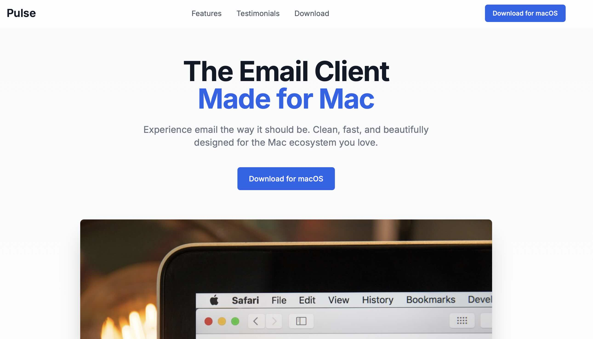

# project_7_pulse_landing_page



## Stack

- Collaborate with AI software development team, i.e., Team Leader Mike, Product Manager Emma, Architect Bob, Engineer Alex, and Data Analyst David at [MetaGPT X](https://mgx.dev)

## URL

Cloudflare Pages: [https://pulse-landing-page.pages.dev](https://pulse-landing-page.pages.dev)

## Prompt (Zero-Shot)

Create a modern, minimalist landing page for a Mac-exclusive email app. The design should be clean, elegant, and focused on simplicity and productivity. Highlight key features such as distraction-free inbox, smart filtering, fast search, and seamless macOS integration. Include a hero section with a mockup of the app on a MacBook, concise feature highlights, user testimonials, and a clear call-to-action (e.g., "Download for macOS"). Use a neutral color palette (e.g., white, soft gray, accent blue), ample whitespace, and smooth typography (like San Francisco or Inter). The tone should reflect calm efficiency and premium design.

## Project Structure

```
├── src/
│   ├── App.jsx          # Main application component
│   ├── main.jsx         # Application entry point
│   └── index.css        # Global styles (Tailwind)
├── index.html           # HTML template
├── vite.config.js       # Vite configuration
├── tailwind.config.js   # Tailwind configuration
├── postcss.config.js    # PostCSS configuration
└── eslint.config.js     # ESLint configuration
```
